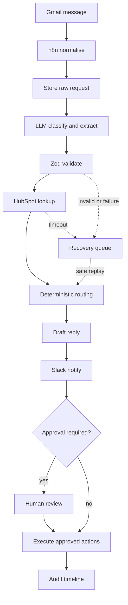

# Automated process map (EVID-002)

Source diagram for portfolio export. Export to `automated-process.png` when ready.

```mermaid
flowchart TD
  gmail[Gmail message]
  n8n[n8n normalise]
  store[Store raw request]
  llm[LLM classify and extract]
  zod[Zod validate]
  hubspot[HubSpot lookup]
  rules[Deterministic routing]
  draft[Draft reply]
  slack[Slack notify]
  approval{Approval required?}
  human[Human review]
  exec[Execute approved actions]
  audit[Audit timeline]
  recover[Recovery queue]

  gmail --> n8n --> store --> llm --> zod --> hubspot --> rules --> draft --> slack --> approval
  approval -->|yes| human --> exec --> audit
  approval -->|no| exec
  zod -.->|invalid or failure| recover
  hubspot -.->|timeout| recover
  recover -->|safe replay| rules
```
