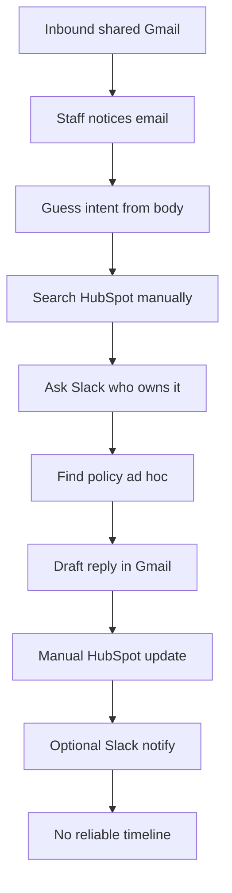

# Manual process map (EVID-001)

Source diagram for portfolio export. Export to `manual-process.png` when ready.

```mermaid
flowchart TD
  inbound[Inbound shared Gmail]
  notice[Staff notices email]
  guess[Guess intent from body]
  crm[Search HubSpot manually]
  ask[Ask Slack who owns it]
  policy[Find policy ad hoc]
  draft[Draft reply in Gmail]
  update[Manual HubSpot update]
  slack[Optional Slack notify]
  noAudit[No reliable timeline]

  inbound --> notice --> guess --> crm --> ask --> policy --> draft --> update --> slack --> noAudit
```
